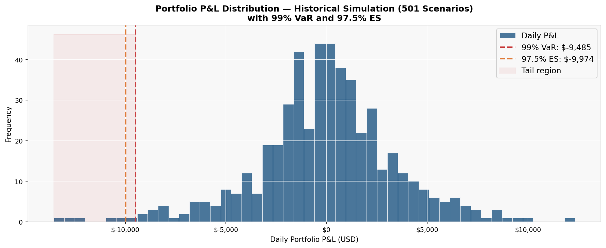
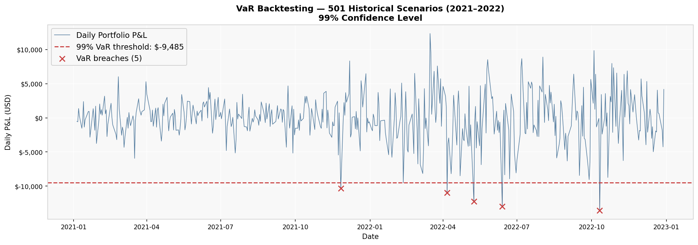
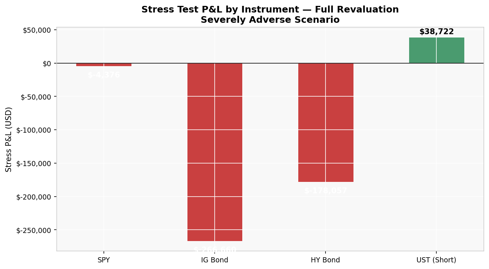

# Market Risk Analysis
## VaR, Expected Shortfall & Stress Testing

    

## What I built

I put together a full market risk measurement framework around a mixed long and short portfolio of equity, investment grade credit, high yield credit, and US Treasury instruments. It runs from instrument pricing and sensitivity work through historical simulation **VaR** and **Expected Shortfall**, stress testing under a severely adverse macro scenario, **VaR** backtesting, and regulatory scaling under **FRTB**. I wanted something that feels like how a market risk desk at a bank actually sequences the work, not just a formula run.

## The portfolio

The book is long **30** SPY ETF positions, long **10,000** positions on a 10 year investment grade corporate bond (A rating, 5% coupon), long **10,000** positions on a 2 year high yield corporate bond (BB rating, 7% coupon), and short **20,000** positions on a 5 year US Treasury (3.875% coupon). All bonds are priced at **$100** notional using continuous compounding discounting. The short Treasury is there on purpose as a partial rate hedge, and one thing the analysis makes clear is how partial that hedge really is.

## Key findings

A few things stood out once the numbers were in:

- Portfolio 1 day 99% VaR is **$9,485**, with the worst scenario landing on 2022-02-11 when U.S. CPI came in at 7.5% YoY, the highest since 1982, triggering a simultaneous selloff across equity, rates, and credit
- Expected Shortfall at 97.5% is **$9,974**, an ES/VaR ratio of 1.05x, which tells me the tail does not blow out dramatically beyond the VaR threshold in this historical window
- Under a stress scenario modeled on 2008, the portfolio loses **$410,371**, which is 43x larger than the 1 day VaR. That gap is not a model failure. It is exactly what VaR was never built to capture
- The IG bond drives 65% of stress losses because of its long duration (10 year) and large size. CS01 of $1,007 per bps is roughly 12x larger than PV01 of $82, so this portfolio is far more sensitive to credit spread moves than to rate moves
- The short Treasury adds **+$38,722** in the stress scenario as rates rise, which confirms the rate hedge idea. It does nothing for the credit side, and that is where most of the risk actually sits
- VaR backtesting landed in the Basel III green zone, which gives me comfort the model is not systematically underestimating risk in normal conditions

## So what

The portfolio looks diversified if you only read the sleeve labels. You have equity, investment grade credit, high yield, and a short rate leg. Once you run the sensitivities it is almost entirely a credit risk book. **CS01** of **$1,007** per bps dominates **PV01** of **$82**, so spread widening is on the order of **12x** more painful than parallel rate moves for this setup. The short **UST** helps on rates and does not hedge credit at all. Under the stress scenario the portfolio loses **$410,371**, and **65%** of that comes from the single **IG** bond alone.

The real story is the gap between **$9,485** **VaR** and **$410,371** stress loss. **VaR** is about a bad day inside what you have already seen in the data. Stress testing is about the world where history is not a good guide. That gap is a big part of why regulators pushed toward **Expected Shortfall** and scenario based capital under **Basel III** and **FRTB**. Building both views in parallel and watching how differently they describe the same book is what made this project feel worth finishing.

## Visuals

*Portfolio P&L distribution across **501** historical scenarios with **99%** **VaR** and **97.5%** **ES** marked.*

***VaR** backtesting chart showing daily P&L against the **99%** threshold across the full **2021** to **2022** window.*

*Stress P&L by instrument under the severely adverse scenario using full revaluation.*

## How it's structured

The notebook runs in **eleven** sections in a fixed order on purpose. It opens with data loading and instrument pricing, steps into sensitivities, then historical simulation for **VaR** and **ES**, then **VaR** backtesting right after so you see whether the threshold behaves before you move on. Stress testing comes next. Risk limits sit after every measure is on the table so the limits tie to real numbers, not vibes. The tail covers **DV01** by tenor, risk factor correlations, and **FRTB** liquidity horizon scaling. The long form methodology and narrative live in the [PDF report](report/report.pdf), [**codebase.ipynb**](codebase.ipynb) is the engine.

## Where to look

| Path | What you will find |
|---|---|
| [**codebase.ipynb**](codebase.ipynb) | The full analysis: pricing, sensitivities, VaR, ES, backtesting, stress testing, DV01, correlations, FRTB |
| [**data/**](data/) | [Market data time series](data/market%20data%20time%20series.xlsx) (**502** daily observations, Jan **2021** to Dec **2022**) |
| [**output/**](output/) | All exported charts (PNG) and CSV results |
| [**report/**](report/) | Write-up: [**report.tex**](report/report.tex) (LaTeX source), [**report.pdf**](report/report.pdf) (compiled PDF) |

## Stack

Python **3.12** · NumPy · Pandas · Matplotlib · Seaborn · Jupyter

## A note on where this came from

This began as a course assignment in my Master of Financial Risk Management program at Rotman. I rebuilt and extended it into a standalone portfolio project, with my course instructor aware of that. The methodology, implementation, code, and write up are my own. The market data is public and lives in this repo.
